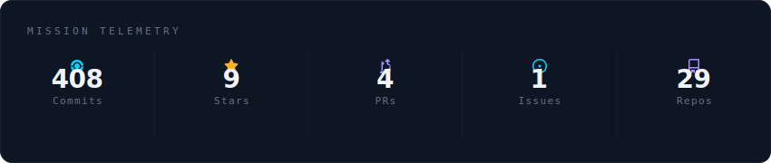

  

  

   

  ## 👋 Sobre mim
  Porém, sou mais conhecido como **Augusto**.  
  Sou apaixonado por tecnologia e sempre amei a área de programação.  
  Desde jovem, venho explorando esse campo incrível.  
  Como costumo dizer, programar é uma **arte**.

   

  

    
  

  ## 🔗 Contato
  

    
    
    
  

---

## ⚡ Skills

  
  
  
  
  
  
  
  
  
  
  
  

---

## 📊 Estatísticas do GitHub

  
   
  

---

## 🐍 Cobrinha dos commits

<picture>
  <source media="(prefers-color-scheme: dark)"
    srcset="https://raw.githubusercontent.com/pehaalmeida/pehaalmeida/output/github-contribution-grid-snake-dark.svg" />
  <source media="(prefers-color-scheme: light)"
    srcset="https://raw.githubusercontent.com/pehaalmeida/pehaalmeida/output/github-contribution-grid-snake.svg" />
  
</picture>

---

  

